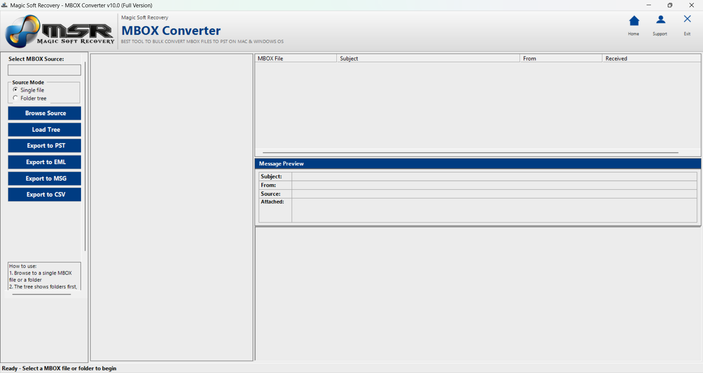
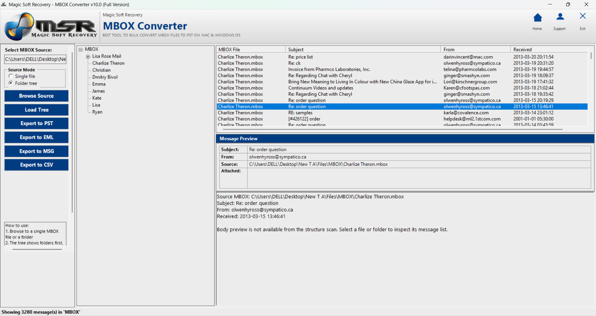
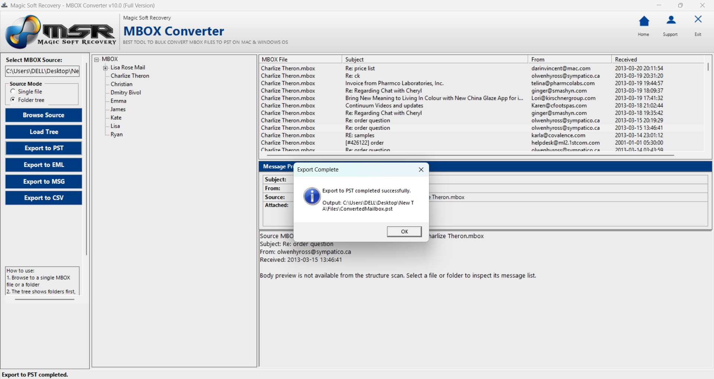

# **Magic Soft MBOX Converter**
Migrate MBOX Files to Exchange, Office 365, Gmail, Outlook.com &amp; Yahoo Mail — Plus Export to PST, MSG, EML &amp; PDF

  

🔵 **Magic Soft MBOX Converter 10.1**  
[Magic Soft MBOX Converter](https://www.magicsoftrecovery.com/mbox-converter/)

**Migrate MBOX Files to Exchange, Office 365, Gmail, Outlook.com & Yahoo Mail — Plus Export to PST, MSG, EML & PDF**

*Trusted by IT Professionals, System Administrators & Enterprises Worldwide*

© 2016 – 2026 [Magic Soft Recovery LLC](https://www.magicsoftrecovery.com/)

 

[⬇️ Download Free Demo](#-download--free-demo) • [✨ Features](#-key-features) • [📖 How to Use](#-how-to-use--step-by-step) • [💻 System Requirements](#-system-requirements) • [❓ FAQ](#-frequently-asked-questions) • [📞 Contact](#-contact--support)

---

## 🔍 What is Magic Soft MBOX Converter?

**Magic Soft MBOX Converter 10.1** is a professional Windows utility developed by **Magic Soft Recovery LLC** — a company with decades of experience in data recovery and email conversion solutions.

This tool is built to do one thing exceptionally well: **migrate and convert MBOX files from popular email clients** (Thunderbird, Apple Mail, Gmail Takeout, and more) into modern platforms including **Exchange Server, Office 365, Gmail, Outlook.com, and Yahoo Mail** — plus export to file formats like **PST, MSG, EML, and PDF**.

Whether you're migrating from Thunderbird to Office 365, archiving Apple Mail to PDF, importing Gmail Takeout backups into Exchange, or converting MBOX files for long-term storage — Magic Soft MBOX Converter handles the entire process with precision.

**Migrate. Convert. Archive. All in one tool — on any Windows machine.**

---

## 🚀 Why IT Teams & System Administrators Trust Magic Soft

MBOX files are used by dozens of email clients, but migrating them to modern platforms is notoriously difficult. Most organizations face these scenarios during:

- **Email platform migrations** (Thunderbird to Office 365, Apple Mail to Exchange)
- **Employee onboarding/offboarding** (importing personal email archives into corporate mailboxes)
- **Gmail Takeout imports** (restoring Google account backups to Exchange or Office 365)
- **Compliance archiving** (converting MBOX to PDF for legal hold and regulatory requirements)
- **Cross-platform transitions** (moving from Mac to Windows, or open-source to enterprise platforms)

Most tools only convert MBOX to file formats, or require complex manual processes for cloud migration. **Magic Soft MBOX Converter was engineered for both scenarios.** It reads MBOX files directly, extracts every recoverable email and attachment, and either uploads them directly to cloud platforms or exports them to the file format you need.

The result is a tool that doesn't just convert MBOX files. **It migrates entire mailboxes to modern platforms with zero data loss.**

---

## ✨ Key Features

### 📂 Output Formats & Migration Targets

| Output / Target | Best Used For |
|-----------------|---------------|
| **Exchange Server** | Direct migration to on-premises Exchange (2003–2019) |
| **Office 365** | Cloud migration to Microsoft 365 mailboxes |
| **Gmail** | Import MBOX archives to Gmail or Google Workspace accounts |
| **Outlook.com** | Migrate to personal or business Outlook.com mailboxes |
| **Yahoo Mail** | Transfer MBOX emails to Yahoo Mail accounts |
| **PST** | Convert to Outlook-compatible PST for local archiving |
| **MSG** | Individual email files compatible with Outlook |
| **EML** | Universal cross-platform email format |
| **PDF** | Archive emails as PDF documents with full metadata |

---

### 📥 Supported MBOX Sources

Magic Soft MBOX Converter supports MBOX files from all major email clients:

✅ **Mozilla Thunderbird**  
✅ **Apple Mail** (macOS Mail.app exports)  
✅ **Gmail Takeout** (Google account backup archives)  
✅ **Opera Mail**  
✅ **Eudora**  
✅ **SeaMonkey**  
✅ **Spicebird**  
✅ **Entourage** (Microsoft Entourage for Mac)  
✅ **Claws Mail**  
✅ **Poco Mail**  
✅ **The Bat!**  
✅ **Any standard MBOX format file**

---

### ⚡ Core Capabilities

✅ **Direct Cloud Migration**  
Upload MBOX emails directly to Exchange Server, Office 365, Gmail, Outlook.com, and Yahoo Mail — no intermediate file conversion required.

✅ **Complete Email Data Migration**  
Migrates every element of your emails — Subject, Date, Time, To, From, CC, BCC, and all attachments — exactly as they existed. Not a single field is left behind.

✅ **Full Mailbox Item Recovery**  
Migrates every item type stored in your MBOX file:
- 📥 Inbox emails with all attachments
- 📤 Sent items
- 🗑️ Deleted items / Trash
- 📝 Drafts
- 🚫 Spam / Junk folder
- 📁 Custom folders and labels

✅ **Batch MBOX Processing**  
Load multiple MBOX files at once and migrate them in a single operation. Perfect for organizations migrating dozens or hundreds of mailboxes.

✅ **Tree-View Preview Interface**  
Before migrating a single email, the demo and full version display your entire MBOX mailbox in a visual tree structure — browse every folder, read individual emails, and select exactly what you want to migrate.

✅ **Selective Migration**  
Choose to migrate your entire mailbox or select specific folders, email ranges, or date filters. Full control over what gets migrated and where it goes.

✅ **Folder Structure Preservation**  
Maintains the original folder hierarchy from your MBOX file — Inbox, Sent, custom folders, and nested subfolders all transfer exactly as organized.

✅ **100% Local Processing (File Exports)**  
File format exports (PST, MSG, EML, PDF) run entirely on your local machine. No data is uploaded to any external server during file conversion. Cloud migrations use secure IMAP/API connections directly to your target platform.

✅ **Automated Migration Engine**  
Built-in automated features handle the complex migration logic in the background — no technical expertise required. Load the file, preview the data, select your target, migrate.

---

## 🎯 Common MBOX Migration Scenarios — And How Magic Soft Handles Them

Magic Soft MBOX Converter is specifically designed to address the most common MBOX migration challenges:

| Migration Scenario | Magic Soft Solution |
|--------------------|---------------------|
| **Thunderbird to Office 365** | Direct cloud migration with folder structure preservation |
| **Apple Mail to Exchange Server** | Converts and uploads MBOX exports to on-premises Exchange |
| **Gmail Takeout to Office 365** | Imports Google backup archives into Microsoft 365 mailboxes |
| **MBOX to PST for archiving** | Converts MBOX to Outlook-compatible PST for long-term storage |
| **MBOX to PDF for legal hold** | Exports emails as PDF with full metadata for compliance |
| **Cross-platform migration** | Moves emails from Mac/Linux clients to Windows/Exchange environments |
| **Bulk mailbox migration** | Batch processing for migrating multiple MBOX files simultaneously |

---

## 👥 Who Needs Magic Soft MBOX Converter?

🏢 **IT Administrators & System Managers**  
Migrate user mailboxes from Thunderbird, Apple Mail, or other MBOX-based clients to Exchange Server or Office 365. Batch processing handles entire departments in a single operation.

⚖️ **Legal Professionals & Law Firms**  
Convert MBOX email archives to PDF for e-discovery, litigation support, and court submissions. Every timestamp, sender, recipient, and attachment is preserved with forensic accuracy.

🏦 **Compliance & Records Management Teams**  
Convert and archive MBOX files to PST or PDF for long-term storage in document management systems. Metadata integrity ensures records hold up under audit and regulatory scrutiny (GDPR, HIPAA, SOX).

🛠️ **Email Migration Specialists**  
When clients need to move from open-source or legacy email clients to enterprise platforms, Magic Soft MBOX Converter is the professional-grade tool that handles the migration with zero data loss.

👤 **Individual Users**  
Switching from Thunderbird to Outlook? Moving from Mac to Windows? Need to import your Gmail Takeout backup into Office 365? Magic Soft MBOX Converter lets you migrate everything — folders, emails, attachments — without losing a single message.

---

## 📥 Download & Free Demo

⬇️ **[Download Free Demo — Magic Soft MBOX Converter 10.1](https://www.magicsoftrecovery.com/demo/magic-soft-mbox-converter.exe)**

The free demo version gives you hands-on access to the full software interface and lets you see your email data before purchasing:

✔️ Load your MBOX file and view the complete folder tree  
✔️ Preview every email, folder, and attachment  
✔️ Test migration to any target platform or file format  
✔️ Evaluate conversion quality and folder structure preservation  

💡 **Upgrade to the full version** for complete, unlimited migration of all emails — including inbox, sent items, deleted items, drafts, custom folders, and all attachments — with priority support and lifetime updates.

---

## 📖 How to Use — Step by Step

Migrating an MBOX file takes just a few minutes.

### Step 1 — Install & Launch
Install Magic Soft MBOX Converter on any Windows machine (XP through Windows 11). If Microsoft .NET Framework 8.0 is not present, the setup installer will install it automatically.

### Step 2 — Add Your MBOX File
Click **"Add MBOX File"** and browse to the location of your `.mbox` file — whether it's from Thunderbird, Apple Mail, Gmail Takeout, or any other MBOX-based email client.

### Step 3 — Scan & Preview
The software scans the MBOX file and displays all email data in an interactive tree-view interface. Browse your Inbox, Sent Items, Deleted Items, Drafts, custom folders — see exactly what is available before committing to a migration.

### Step 4 — Select Items for Migration
Choose your entire mailbox, specific folders, individual emails, or any combination. The selective migration feature ensures you transfer only what you need.

### Step 5 — Choose Migration Target or Export Format
Select your target:

**Cloud Migration:**
- Exchange Server (enter server credentials)
- Office 365 (enter Microsoft 365 credentials)
- Gmail (enter Gmail/Google Workspace credentials)
- Outlook.com (enter Outlook.com credentials)
- Yahoo Mail (enter Yahoo Mail credentials)

**File Export:**
- PST — to import into Outlook
- MSG — for Outlook-compatible individual email files
- EML — for cross-platform universal email access
- PDF — for archiving and legal documentation

### Step 6 — Migrate or Convert & Save
Click **Migrate** (for cloud targets) or **Convert** (for file exports). The migration engine processes your file, extracts all selected data, and either uploads it to your cloud mailbox or saves perfectly organized output to your chosen destination folder — metadata intact, attachments included, folder structure preserved.

## 🖥️ Software Screenshots

---

## 📊 What Gets Migrated & Preserved

| Data Type | Migrated? |
|-----------|-----------|
| Inbox Emails with Attachments | ✅ Yes |
| Sent Items | ✅ Yes |
| Deleted Items / Trash | ✅ Yes |
| Drafts | ✅ Yes |
| Spam / Junk Folder | ✅ Yes |
| Custom Folders & Labels | ✅ Yes |
| Subject Line | ✅ Yes |
| Date & Time Stamps | ✅ Yes |
| To / From / CC / BCC Fields | ✅ Yes |
| File Attachments | ✅ Yes |
| Folder Structure & Hierarchy | ✅ Yes |

---

## 💻 System Requirements

### Operating System Compatibility

Magic Soft MBOX Converter 10.1 is compatible with all major Windows versions:

| Windows Version | Supported |
|-----------------|-----------|
| Windows XP | ✅ |
| Windows Vista | ✅ |
| Windows 7 | ✅ |
| Windows 8 | ✅ |
| Windows 10 | ✅ |
| Windows 11 | ✅ |
| Windows 2000 | ✅ |
| Windows Server 2000 | ✅ |
| Windows Server 2003 | ✅ |
| Windows Server 2008 | ✅ |
| Windows NT | ✅ |

### Hardware & Software Requirements

| Requirement | Minimum | Recommended |
|-------------|---------|-------------|
| Processor | Pentium III / 800 MHz | Modern Intel/AMD processor |
| RAM | 256 MB | 1 GB or more |
| Display | 800 × 600 resolution | 1280 × 720 or higher |
| Disk Space | 200 MB free | 1 GB+ (for output files) |
| .NET Framework | 8.0 (auto-installed) | 8.0 |
| Internet Connection | Required for cloud migration | Required for cloud migration |
| Microsoft Outlook | ❌ Not required | ❌ Not required |

### Supported MBOX Email Clients

Magic Soft MBOX Converter supports MBOX files from all of the following email clients:

`Thunderbird` · `Apple Mail` · `Gmail Takeout` · `Opera Mail` · `Eudora` · `SeaMonkey` · `Spicebird` · `Entourage` · `Claws Mail` · `Poco Mail` · `The Bat!` · `Any standard MBOX format`

---

## 🔐 Privacy & Data Security

**File exports** (PST, MSG, EML, PDF) run **100% locally on your machine**. Magic Soft MBOX Converter does not upload your files or transmit your email data during file conversion.

**Cloud migrations** (Exchange, Office 365, Gmail, Outlook.com, Yahoo Mail) use secure IMAP or API connections directly to your target platform. Your credentials are used only for authentication and are never stored or transmitted to third parties.

This architecture makes Magic Soft MBOX Converter suitable for:

🏥 Healthcare organizations under HIPAA data handling requirements  
🏦 Financial institutions under GDPR, SOX, and PCI-DSS frameworks  
⚖️ Law firms handling privileged attorney-client communications  
🏛️ Government agencies with data residency requirements  
🔒 Any organization with a zero-trust security policy

---

## ❓ Frequently Asked Questions

<strong>Do I need Microsoft Outlook installed to use Magic Soft MBOX Converter?</strong>

No. Magic Soft MBOX Converter works completely independently of Microsoft Outlook. There is no requirement to have Outlook or any Microsoft Office product installed on your machine. This makes it ideal for dedicated migration workstations.

<strong>Can Magic Soft MBOX Converter migrate directly to Office 365?</strong>

Yes. Magic Soft MBOX Converter supports direct cloud migration to Office 365, Exchange Server, Gmail, Outlook.com, and Yahoo Mail. Simply enter your credentials and the software uploads your MBOX emails directly to the target mailbox.

<strong>What MBOX email clients are supported?</strong>

Magic Soft MBOX Converter supports MBOX files from Thunderbird, Apple Mail, Gmail Takeout, Opera Mail, Eudora, SeaMonkey, Spicebird, Entourage, Claws Mail, Poco Mail, The Bat!, and any standard MBOX format file.

<strong>What does the free demo show me?</strong>

The demo version scans your MBOX file and displays all email data in a tree-view interface — browsable folders, individual emails, and attachments. You can see exactly what is available before purchasing the full version. The demo allows preview of items; the full version enables complete migration and export of all emails.

<strong>What output formats and migration targets are available?</strong>

Magic Soft MBOX Converter supports direct cloud migration to Exchange Server, Office 365, Gmail, Outlook.com, and Yahoo Mail. It also exports to PST (Outlook-compatible), MSG (individual email files), EML (universal email format), and PDF (archival documents). Choose the option that best matches your migration or archiving needs.

<strong>Is my data safe during the migration process?</strong>

Yes. File exports run entirely on your local machine with no data uploaded to external servers. Cloud migrations use secure IMAP/API connections directly to your target platform. Your credentials are used only for authentication and are never stored or shared.

<strong>Can I migrate multiple MBOX files at once?</strong>

Yes. Magic Soft MBOX Converter supports batch processing. Load multiple MBOX files and migrate them in a single operation — perfect for organizations migrating dozens or hundreds of mailboxes.

<strong>Will my folder structure be preserved?</strong>

Yes. Magic Soft MBOX Converter maintains the original folder hierarchy from your MBOX file. Inbox, Sent, custom folders, and nested subfolders all transfer exactly as organized in the source file.

<strong>What .NET Framework version is required?</strong>

Magic Soft MBOX Converter requires Microsoft .NET Framework 8.0. If it is not already installed on your system, the Magic Soft setup installer will detect this and install .NET Framework 8.0 automatically — no manual download required.

<strong>Is this a one-time purchase or a subscription?</strong>

Magic Soft MBOX Converter is a one-time purchase. There is no recurring subscription fee. The full version includes lifetime software updates at no additional cost.

---

## 🧩 Related Products by Magic Soft Recovery LLC

Magic Soft Recovery LLC builds a complete suite of professional email recovery and conversion tools:

| Product | What It Does |
|---------|--------------|
| [Magic Soft PST Converter](https://www.magicsoftrecovery.com/pst-converter/) | Convert corrupted and inaccessible PST files to MSG, EML, DBX & PST — no Outlook required |
| [Magic Soft OST Converter](https://www.magicsoftrecovery.com/ost-converter/) | Convert orphaned and inaccessible Outlook OST files to PST, MSG, EML & PDF — no Exchange Server connection required |

All Magic Soft tools are built on the same foundation: **no Outlook dependency, 100% local processing (for file exports), full metadata preservation, and a free demo** so you can test on your own files before purchasing.

---

## 🌟 User Testimonials

> *"We migrated 200+ users from Thunderbird to Office 365. Magic Soft MBOX Converter handled the batch migration flawlessly. Folder structure came through perfectly on every mailbox."*  
> **— IT Manager, Educational Institution**

> *"Needed to import a Gmail Takeout archive into our corporate Exchange Server. This tool made it effortless — 12 years of emails migrated with all attachments intact."*  
> **— System Administrator, Financial Services**

> *"As an email migration consultant, this is my go-to tool for MBOX to Office 365 migrations. The direct cloud upload feature saves hours compared to manual import methods."*  
> **— Independent IT Consultant**

> *"Used this to convert Apple Mail MBOX files to PDF for a legal case. Every email had full metadata preserved — timestamps, sender, recipients, attachments. Passed legal review without issues."*  
> **— Legal Associate, Corporate Law Firm**

---

## 📈 Search Reference

If you found this repository by searching for any of the following terms, you are in the right place:

`MBOX converter` · `MBOX to PST converter` · `MBOX to Office 365 migration` · `Thunderbird to Exchange` · `Apple Mail to Outlook` · `Gmail Takeout import` · `MBOX to Gmail` · `convert MBOX to EML` · `MBOX to MSG converter` · `MBOX to PDF converter` · `MBOX migration tool` · `batch MBOX converter` · `MBOX converter Windows 10` · `MBOX converter Windows 11` · `MBOX to Exchange migration` · `Thunderbird to Office 365` · `MBOX archiving tool` · `MBOX e-discovery tool` · `email migration software` · `MBOX file converter`

---

## 📞 Contact & Support

| Channel | Details |
|---------|---------|
| 🌐 Website | [www.magicsoftrecovery.com](https://www.magicsoftrecovery.com) |
| 📧 Technical Support | support@magicsoftrecovery.com |
| 💼 Sales & Licensing | sales@magicsoftrecovery.com |
| 🔧 Hard Drive Recovery | Contact support for physical drive recovery consultation |

The Magic Soft support team responds to all queries within 24 business hours. For enterprise licensing, volume purchases, or physical hard drive recovery services, contact the team directly.

---

## 📄 License & Legal

**Magic Soft MBOX Converter 10.1** is commercial shareware software.

**Free Demo** — Preview all email data in tree-view. Test migration on your own MBOX files before purchasing.

**Full Version** — Complete, unlimited migration and conversion of all emails. One-time purchase. Lifetime updates included.

© 2016 – 2026 Magic Soft Recovery LLC. All rights reserved.

Magic Soft MBOX Converter and the Magic Soft name and logo are trademarks of Magic Soft Recovery LLC. Microsoft, Outlook, Exchange, Windows, Thunderbird, Apple Mail, Gmail, and other product names are trademarks of their respective owners. Magic Soft Recovery LLC is an independent software company and is not affiliated with, endorsed by, or sponsored by Microsoft Corporation, Mozilla, Apple, or Google.

---

[⬇️ Download Free Demo](https://www.magicsoftrecovery.com) | [🌐 Visit Website](https://www.magicsoftrecovery.com) | [📧 Technical Support](mailto:support@magicsoftrecovery.com) | [💼 Sales](mailto:sales@magicsoftrecovery.com)

 

⭐ **Found this helpful? Star this repository to help others find Magic Soft MBOX Converter.**

 

© 2016 – 2026 Magic Soft Recovery LLC — **Migrate. Convert. Archive.**

